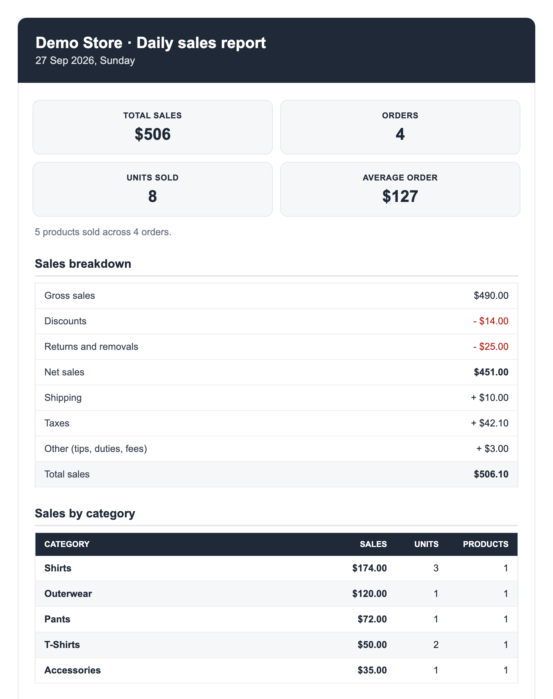

# Shopify Sales Alert

[](https://github.com/hussaintrawadi/shopify-sales-alert/actions/workflows/tests.yml)
[](LICENSE)

[](https://claude.com/claude-code)

Yesterday's Shopify sales in your inbox every morning: revenue, orders, units, average order value, and what sold best. It runs on GitHub Actions for free, so there is no server to host and nothing running on your laptop.

<p align="center">
  
</p>

## What it does

- **The numbers you check first:** total sales, orders, units sold and average order value.
- **A breakdown that adds up:** gross sales, discounts, returns, net sales, shipping, taxes and total, in the same order Shopify's own sales report uses.
- **Top sellers** overall and within each category, with units and sales for each product.
- **Categories your way:** by product type, by vendor, or by keyword rules for stores whose products have no type set.
- **Honest totals.** Cancelled and test orders are left out and mentioned at the bottom. Refunds and removed items come off the numbers.
- **The right day in your timezone**, including the days clocks change.
- **Sends through Resend, Brevo or any SMTP server**, including Gmail with an app password.
- **Uses Shopify's GraphQL Admin API**, with rate limits and retries handled.

## How it works

1. GitHub Actions starts the job on a schedule you pick.
2. It gets a Shopify access token and works out yesterday's start and end in your store's timezone.
3. It reads every order placed in that window, with all of its line items.
4. It adds everything up and sends one HTML email, with a plain-text version, to everyone on your list.

A run takes under a minute.

## Setup

About 15 minutes, once.

### 1. Make your own copy

Click **Use this template** at the top of this page, then **Create a new repository**. Make it private: the workflow logs show your daily revenue.

### 2. Give it access to your store

Pick the row that matches you:

| Your situation | What you set |
|---|---|
| You already have an Admin API access token (`shpat_...`) from a custom app | `SHOPIFY_ACCESS_TOKEN` |
| You create an app in the [Dev Dashboard](https://dev.shopify.com/dashboard) and the store is in the same Shopify organization | `SHOPIFY_CLIENT_ID` and `SHOPIFY_CLIENT_SECRET` |
| You create an app in the Dev Dashboard, but the store belongs to someone else (a client, a collaborator store) | Run `scripts/get_access_token.py` once and set `SHOPIFY_ACCESS_TOKEN` |

To create the app:

1. In the Dev Dashboard, create an app.
2. Give its version the Admin API scopes **`read_orders`** and **`read_products`**, and release it.
3. Install the app on your store.
4. Copy the **Client ID** and **Client secret** from the app's settings.

The report reads order totals and line items only. It never asks for customer names, emails or addresses.

The second row mints a fresh token on every run, which Shopify allows for apps and stores in the same organization. If the run fails with `shop_not_permitted`, you are in the third row. Add `http://localhost:3456/callback` to the app's allowed redirect URLs, release again, then:

```bash
export SHOPIFY_STORE_DOMAIN=your-store.myshopify.com
export SHOPIFY_CLIENT_ID=...
export SHOPIFY_CLIENT_SECRET=...
python3 scripts/get_access_token.py
```

A browser opens, you approve the app, and the terminal prints a token that does not expire. That token goes in `SHOPIFY_ACCESS_TOKEN`.

### 3. Pick an email provider

| Provider | Good for | What you need |
|---|---|---|
| [Resend](https://resend.com) (default) | Sending from your own domain | A domain you can add DNS records to, and an API key |
| [Brevo](https://www.brevo.com) | No DNS access | One verified sender address, and an API key |
| SMTP | Gmail, Outlook, or your own mail server | Host, port, username and password (for Gmail, an [app password](https://support.google.com/accounts/answer/185833)) |

All three have free tiers that cover one email a day.

### 4. Add your secrets

In your copy, open **Settings → Secrets and variables → Actions → Secrets** and add:

| Secret | Example | Needed |
|---|---|---|
| `SHOPIFY_STORE_DOMAIN` | `your-store.myshopify.com` | Always |
| `SHOPIFY_ACCESS_TOKEN` | `shpat_...` | Or the two below |
| `SHOPIFY_CLIENT_ID` | from the Dev Dashboard | Or the token above |
| `SHOPIFY_CLIENT_SECRET` | from the Dev Dashboard | Or the token above |
| `EMAIL_API_KEY` | `re_...` or `xkeysib-...` | Resend or Brevo |
| `EMAIL_FROM` | `Sales Report <reports@yourdomain.com>` | Always |
| `EMAIL_TO` | `founder@yourdomain.com, team@yourdomain.com` | Always |
| `SMTP_USERNAME`, `SMTP_PASSWORD` | | SMTP only |

### 5. Optional: tune it

Everything else has a sensible default. To change one, add it under **Variables** on the same page:

| Variable | Default | What it does |
|---|---|---|
| `EMAIL_PROVIDER` | `resend` | `resend`, `brevo` or `smtp` |
| `SMTP_HOST`, `SMTP_PORT` | `587` | SMTP server. Port 465 uses SSL, anything else uses STARTTLS |
| `STORE_NAME` | Your Shopify store name | Name in the subject and header |
| `REPORT_TIMEZONE` | Your store's timezone | Which "yesterday" to report, e.g. `Asia/Kolkata` |
| `BRAND_COLOR` | `#1f2937` | Header, heading and table colour |
| `GROUP_BY` | `product_type` | `product_type`, `vendor`, `rules` or `none` |
| `CATEGORY_RULES_FILE` | `categories.yaml` | Keyword rules, used when `GROUP_BY` is `rules` |
| `TOP_N` | `10` | Rows in each top-sellers table |
| `INCLUDE_TEST_ORDERS` | `false` | Count orders placed with Shopify's test gateway |
| `SEND_WHEN_NO_ORDERS` | `true` | Set `false` to skip the email on days with no orders |
| `SHOPIFY_API_VERSION` | `2026-07` | Shopify API version |

### 6. Choose the time

Edit the `cron` line in [`.github/workflows/sales-alert.yml`](.github/workflows/sales-alert.yml). It is in UTC: `30 3 * * *` is 09:00 in India, and `0 13 * * *` is 09:00 in New York during summer time. [crontab.guru](https://crontab.guru) helps. Whatever time it runs, the report always covers the previous full day in your store's timezone.

### 7. Test it

Open the **Actions** tab, pick **Daily sales report**, click **Run workflow** and tick **dry run**. The run page then has an `email-preview` download with the email it would have sent. You can also type a date to report a day other than yesterday. When it looks right, run it again without the tick to send a real one.

## Categories without product types

If your products have no product type in Shopify, set `GROUP_BY` to `rules`, copy `categories.example.yaml` to `categories.yaml`, and commit it:

```yaml
Kits:
  - kit
  - combo
Seeds:
  - seed
```

Each product goes into the first category with a keyword in its title. Anything that matches nothing lands in "Other". Put the most specific categories first.

## How the numbers are worked out

| Line | Meaning |
|---|---|
| Gross sales | Unit price times quantity ordered, before any discount |
| Discounts | Every discount on the order, including order-level codes, spread across the items |
| Returns and removals | Items refunded or removed with an order edit since the order was placed |
| Net sales | Gross sales minus discounts and returns |
| Shipping, Taxes | Current amounts on the orders, after refunds |
| Other | Tips, duties and fees, when there are any |
| Total sales | What customers paid, after refunds. The lines above always add up to it |

Figures cover orders **placed** during the day. A refund made today on last week's order changes last week's numbers, not today's. That matches how most stores read a daily report, but it can differ slightly from Shopify's own analytics, which puts refunds on the day they happen.

If your prices include tax (common in India, the UK and the EU), taxes are shown as "already in prices" and not added again.

## Run it on your computer

```bash
python3 -m venv .venv && source .venv/bin/activate
pip install -r requirements.txt
cp .env.example .env        # fill it in; DRY_RUN=true writes a preview instead of emailing
python -m sales_alert
```

`python scripts/demo.py` renders a sample email from made-up orders, no Shopify account needed.

## Good to know

- **Days more than 60 days back** need the `read_all_orders` scope. Yesterday never does.
- **If Shopify says the app cannot access orders**, open the app in the Dev Dashboard and turn on protected customer data access for orders. Custom apps get it without a review. No customer fields are needed.
- **Scheduled runs can start a few minutes late** when GitHub is busy.
- **In a public repository**, GitHub pauses scheduled workflows after 60 days without any activity. Private copies are not affected.
- **Cost:** each run uses about one minute of GitHub Actions time. Private repositories on the free plan get 2,000 minutes a month.

## Project layout

```
sales_alert/
  __main__.py         entry point: python -m sales_alert
  config.py           reads settings and category rules
  shopify.py          GraphQL client: tokens, pagination, retries
  orders.py           the day's time window and the orders query
  report.py           adds everything up (no network)
  email_template.py   HTML and plain-text email
  mailer.py           Resend, Brevo and SMTP
scripts/
  get_access_token.py one-time offline token for stores in another organization
  demo.py             sample email from test data
tests/                pytest suite, runs without a store
```

## Development

```bash
pip install -r requirements-dev.txt
python -m pytest
```

## Related

[Shopify Stock-Out Alert](https://github.com/hussaintrawadi/shopify-stockout-alert) emails the products and sizes that are out of stock every morning, set up the same way.

## Contributing

Issues and pull requests are welcome. See [CONTRIBUTING.md](CONTRIBUTING.md). For security problems, see [SECURITY.md](SECURITY.md).

## License

[MIT](LICENSE). Built by [Hussain Trawadi](https://github.com/hussaintrawadi), vibe coded with [Claude](https://claude.com/claude-code). It started as a private automation for a D2C brand's founder and was rebuilt here so any Shopify store can use it.
